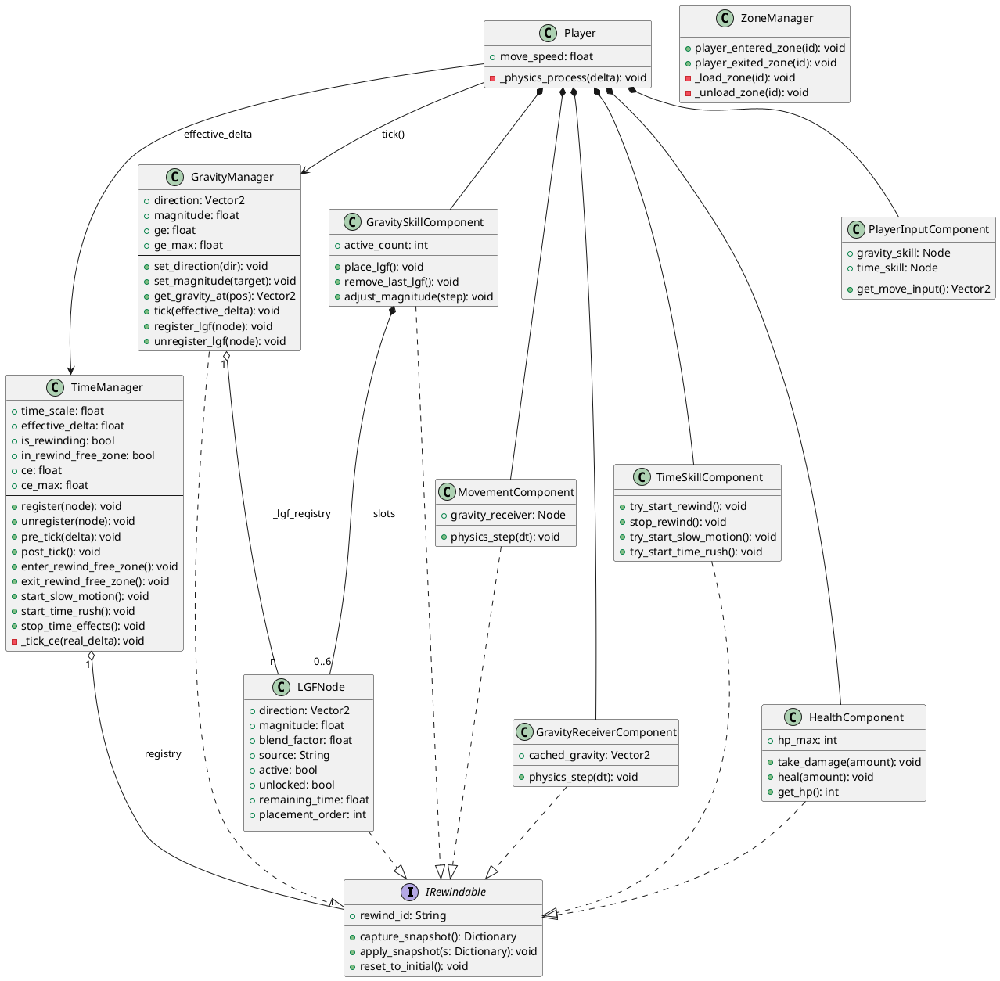
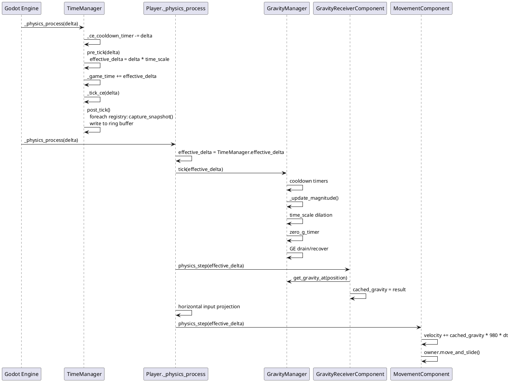

# GravityRush — 核心架构实现设计

> 对应变更：`core-game-architecture`  
> 文档版本：1.0

---

## 1. 架构总览

GravityRush 的核心架构由 **三个 Autoload 单例** 和 **六个 Component 脚本** 构成，通过 **IRewindable 协议** 统一接入时间回溯系统。

```
Autoloads（全局单例，按 project.godot 中顺序初始化）
├── Bootstrap          — 启动日志
├── GravityManager     — 重力状态机（方向/强度/LGF 注册表/GE 资源）
├── TimeManager        — 时间系统（Ring Buffer 回溯/CE 资源/时间流速）
└── ZoneManager        — 区域流式加载/卸载

Scenes/
├── Player.tscn        — CharacterBody2D + Component 树
└── SkillTestLab.tscn  — 开发测试场景（封闭箱 + 平台 + 木箱 + HUD）

Scripts/Components/
├── LGFNode.gd             — 局部重力场节点（Area2D）
├── GravityReceiverComponent.gd — 查询并缓存当前帧重力向量
├── MovementComponent.gd       — 速度积分 + move_and_slide
├── PlayerInputComponent.gd    — 输入转发（不参与回溯）
├── GravitySkillComponent.gd   — 重力切换 + LGF 对象池
├── TimeSkillComponent.gd      — 回溯/慢动作/加速控制
└── HealthComponent.gd         — HP 管理（回溯期间拒绝伤害）
```

---

## 2. IRewindable 协议

任何需要参与时间回溯的节点必须实现以下接口，并在 `_ready()` 中调用 `TimeManager.register(self)`：

| 成员 | 类型 | 说明 |
|------|------|------|
| `rewind_id` | `String` | 全局唯一标识符，格式建议 `"系统/对象"` |
| `capture_snapshot()` | `-> Dictionary` | 返回当前状态快照 |
| `apply_snapshot(s)` | `(Dictionary) -> void` | 还原到快照状态 |
| `reset_to_initial()` | `-> void`（可选） | 还原到初始状态（帧不足时调用） |

---

## 3. 主循环时序

每个物理帧（`_physics_process`）的调度顺序：

```
TimeManager._physics_process(delta)
  ├── _ce_cooldown_timer 倒计时
  ├── pre_tick(delta)          → 计算 effective_delta；若回溯则反向读帧并 apply_snapshot
  ├── [若 is_rewinding] _tick_ce → return（跳过世界步进）
  └── [正常帧]
        ├── _game_time += effective_delta
        ├── _tick_ce(delta)
        └── post_tick()        → 所有 IRewindable 拍快照写入 Ring Buffer

Player._physics_process(delta)
  ├── [若 is_rewinding] return（位置由快照还原）
  ├── GravityManager.tick(effective_delta)   → 冷却/插值/GE/零重力
  ├── GravityReceiverComponent.physics_step  → 查询 get_gravity_at() 缓存
  ├── 水平移动输入投影（切向平面）
  └── MovementComponent.physics_step         → 速度积分 + move_and_slide
```

---

## 4. 各系统职责摘要

### 4.1 GravityManager

- 维护全局重力 `direction`（单位向量）和 `magnitude`（0~3）
- `set_direction()` 扣除 GE 并触发 1.5s 冷却
- `magnitude` 通过 0.2s 线性插值平滑过渡
- `get_gravity_at(pos)` 综合 LGF 注册表返回局部重力向量
- 自身实现 IRewindable（`rewind_id = "sys/gravity"`）

### 4.2 TimeManager

- **Ring Buffer**：MAX_FRAMES=1200（约 20s @ 60fps），环形写入
- **pre_tick**：回溯时按 `REWIND_SPEED=2.0` 倍游戏时间消费帧
- **CE 资源**：回溯 12/s，慢动作 10/s，加速 5/s；零重力加成 3× 恢复
- **Rewind-Free Zone**：进入时清空 Buffer、回满 CE、锁定所有时间技能

### 4.3 ZoneManager

- 维护 `_loaded_zones` 和 `_zone_exit_timestamps`
- 玩家离开区域后超过 20s（≥ 最大回溯时长）才卸载，确保回溯安全

### 4.4 LGFNode（Area2D）

- `source = "player_skill"` 时每秒消耗 6 GE
- `blend_factor = 0` 表示完全覆盖全局重力，`= 1` 完全使用全局重力
- `placement_order` 越大越优先（后置优先）

### 4.5 GravitySkillComponent

- 6 个 LGFNode 槽位（Slot0~2 默认解锁），永驻场景树（对象池）
- `place_lgf()` 激活 `remaining_time = 8s` 的槽位
- 慢动作期间强度调节步进从 0.25 降至 0.05

---

## 5. 资源管理数值

| 资源 | 上限 | 恢复 | 主要消耗 |
|------|------|------|---------|
| GE（Gravity Energy） | 100 | 8/s（无 LGF 时） | 方向切换 −15；player_skill LGF 每个 −6/s |
| CE（Chrono Energy） | 100 | 5/s（无技能时）× 3（零重力≥3s） | 回溯 −12/s；慢动作 −10/s；加速 −5/s |

---

## 6. PlantUML 类图



---

## 7. PlantUML 时序图（一帧正常流程）



---

## 8. 输入映射

| 动作名 | 按键 | 功能 |
|--------|------|------|
| `gravity_flip_down` | S | 全局重力朝下 |
| `gravity_flip_up` | W | 全局重力朝上 |
| `gravity_flip_left` | A | 全局重力朝左 |
| `gravity_flip_right` | D | 全局重力朝右 |
| `time_rewind` | R | 时间回溯（按住） |
| `time_slow` | Q | 慢动作（按住） |
| `time_rush` | E | 时间加速（按住） |
| `place_lgf` | F | 放置局部重力场 |
| `remove_lgf` | G | 移除最近一个 LGF |
